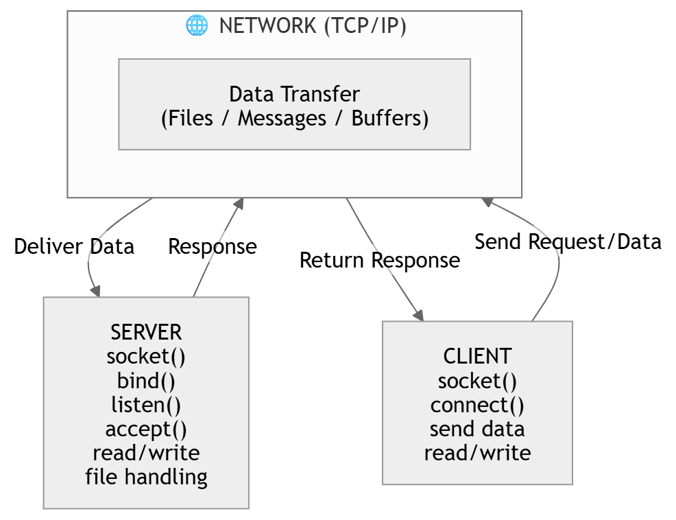
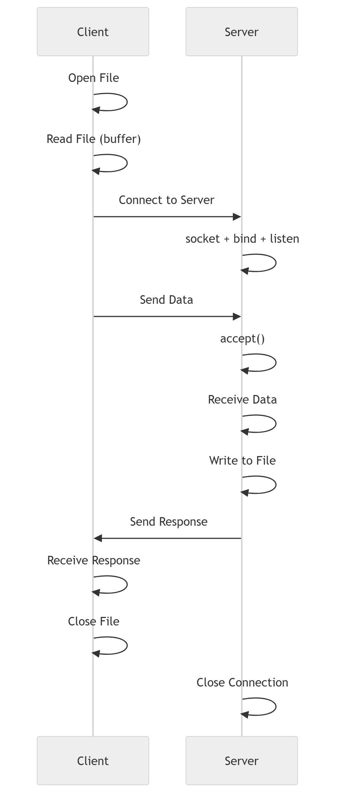

# Linux System Programming (LSP) – Socket, Process & File Handling
This repository is a collection of Linux System Programming (LSP) concepts implemented in C. It covers socket programming, process management, command-line arguments, and file transfer systems.

## 📌Overview

This repository is a collection of **Linux System Programming (LSP)**
concepts implemented in C. It covers **socket programming, process
management, command-line arguments, and file transfer systems**.

The project demonstrates **low-level system interaction**, useful for
system programming interviews and backend fundamentals.

------------------------------------------------------------------------

## 🧠 Concepts Covered

### 🔹 Socket Programming

-   TCP socket creation
-   Server-client architecture
-   Binding, listening, accepting connections
-   Data transmission using read/write
-   IP and port handling

### 🔹 Client-Server File Transfer

-   File transfer using sockets
-   Metadata handling
-   Buffered read/write
-   Error handling

### 🔹 Command Line Arguments

-   argc / argv usage
-   Input validation
-   Dynamic execution

### 🔹 Process Management

-   fork()
-   PID / PPID
-   Parent-child execution

### 🔹 File Handling

-   open, read, write, close
-   stat usage

------------------------------------------------------------------------

## 🧩 Architecture Diagram

## Client-Server Architecture

## File Transfer Flow

## Internal System Flow

------------------------------------------------------------------------

## ⚙️ Compilation & Execution

### Compile

gcc program.c -o output

### Run Server

./output `<port>`{=html}

### Run Client

./output `<IP>`{=html} `<port>`{=html} `<file>`{=html}

------------------------------------------------------------------------

## 📊 System Calls Used

Socket APIs: socket, bind, listen, accept, connect\
File APIs: open, read, write, close\
Process APIs: fork, getpid, getppid\
Networking: htons, inet_addr

------------------------------------------------------------------------

## 💡 Highlights

-   End-to-end client-server system\
-   File transfer implementation\
-   OS-level programming\
-   Interview-focused concepts

------------------------------------------------------------------------

## 🎯 Learning Outcomes

-   TCP communication understanding\
-   Linux process management\
-   File system interaction\
-   System call usage

------------------------------------------------------------------------

## ⭐ Conclusion

This project demonstrates strong understanding of: - Operating Systems -
Networking - System Programming
